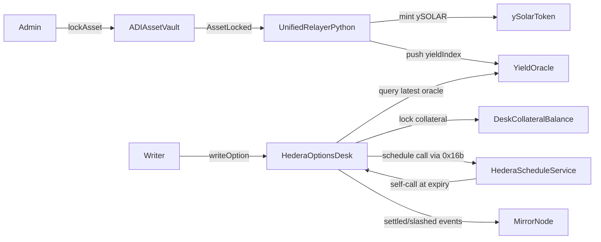

# Architecture Overview

## Scope

- Layer 2: ADI custody vault on generic EVM.
- Layer 3: Hedera clearinghouse with covered calls and scheduled settlement.

## Components

1. `packages/contracts-adi/contracts/ADIAssetVault.sol`
  - ERC-721 principal asset position.
  - Admin lock flow emitting `AssetLocked` and `YieldMintRequested`.
2. `packages/contracts-hedera/contracts/ySolarToken.sol`
  - ERC-20 yield token (`1 ySOLAR = 1 kWh expected yield`).
3. `packages/contracts-hedera/contracts/YieldOracle.sol`
  - Admin-push oracle with `(yieldIndex, updatedAt, roundId)`.
4. `packages/contracts-hedera/contracts/HederaOptionsDesk.sol`
  - OTC covered calls with full collateral lock.
  - One schedule created during `writeOption`.
  - Self-call settlement path and strict oracle freshness checks.
5. `packages/relayer-python/src/service.py`
  - Unified off-chain service for telemetry ingestion, ADI event relay, Hedera mint trigger, and oracle push.

## Data Flow

