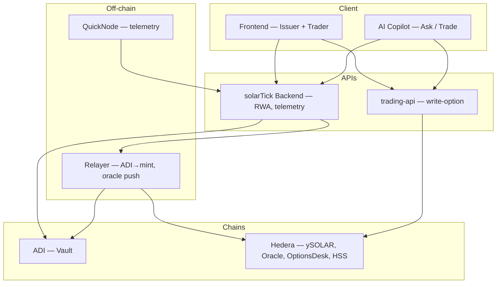

# Architecture Overview

This document describes the full application: RWA minting, tokenisation, options trading, live telemetry, and the AI copilot.

## High-level stack

- **Frontend**: Issuer Portal (mint RWA from asset) and Trader Terminal (positions, charts, orders). Single dashboard app.
- **AI Copilot**: Ask mode (markets, yield, strategy) and Trade mode (natural language → structured intent → same order pipeline). Powered by 0G for LLM inference; uses live asset data and strike-at-submit from oracle source.
- **Trading API**: Order submission for options (write-option). Used by both the UI and the copilot; single pipeline, backend holds signing keys.
- **SolarTick backend**: RWA API (create RWA, bootstrap = mint+lock on ADI), telemetry ingest (QuickNode webhook), live/history endpoints. Runs issuer + data flows.
- **Relayer**: Watches ADI for `YieldMintRequested`; mints ySOLAR on Hedera to beneficiary. Optionally drains oracle queue (DB) and pushes yield index to Hedera.
- **ADI Chain**: Vault contract. Mint RWA asset from operator, lock with expected yield and beneficiary; emits events for relayer.
- **Hedera**: ySOLAR token, YieldOracle, HederaOptionsDesk (covered calls + HSS scheduled settlement).
- **QuickNode**: Live telemetry stream (e.g. solar/energy) delivered to SolarTick backend via webhook. **Required** for full operation (charts, oracle context, adjudication).

## Components

| Layer | Component | Purpose |
|-------|-----------|--------|
| **Frontend** | `packages/frontend` | Issuer Portal + Trader Terminal (Next.js/Vite). Calls SolarTick API and Trading API. |
| **AI** | `packages/ai-copilot` | Two-mode copilot (Ask / Trade). 0G inference; live data client; intent → same order pipeline. |
| **API** | `packages/trading-api` | Write-option endpoint; signing and chain write; used by UI and copilot. |
| **Backend** | `solartick/backend` | RWA CRUD, bootstrap (mint+lock on ADI), telemetry ingest, live/history APIs. |
| **Relayer** | `packages/relayer-python` | ADI event poll → mint ySOLAR; oracle queue → push YieldOracle. |
| **ADI** | `packages/contracts-adi` | `ADIAssetVault`: mint asset, lock asset (emit `YieldMintRequested`). |
| **Hedera** | `packages/contracts-hedera` | `ySolarToken`, `YieldOracle`, `HederaOptionsDesk` (options + HSS). |

## Data flow

1. **RWA mint (issuer)**  
   User submits asset params (e.g. expected yield kwh) → SolarTick backend creates RWA row, calls ADI vault `mintAsset` + `lockAsset` → vault emits `YieldMintRequested` → relayer mints ySOLAR on Hedera to beneficiary.

2. **Telemetry**  
   QuickNode stream → webhook to SolarTick backend → DB (e.g. `rwa_timeseries`, oracle queue). Relayer can push from queue to YieldOracle. Frontend and copilot consume live/history APIs.

3. **Options (write → settle)**  
   Writer (UI or copilot Trade intent) → Trading API → `writeOption` on Hedera (desk locks ySOLAR, creates HSS schedule). At expiry, schedule self-calls `settleOption`; desk reads YieldOracle and emits OptionSettled / CollateralReleased / CollateralSlashed.

4. **Copilot**  
   Chat → 0G LLM; live data client injects yield/price context. Trade mode: NL → intent (writer, buyer, amount, strike, expiry) → user confirm → strike from oracle source → Trading API (same path as UI).

## Diagram

## Contract details

- **ADIAssetVault** (ADI): ERC-721–style asset positions; `mintAsset(to)`, `lockAsset(assetId, expectedYieldKWh, beneficiary)`; emits `AssetMinted`, `AssetLocked`, `YieldMintRequested`.
- **ySolarToken** (Hedera): ERC-20 yield token; 1 ySOLAR = 1 kWh expected yield; minter role for relayer.
- **YieldOracle** (Hedera): Admin-push oracle `(yieldIndex, updatedAt, roundId)`; used by OptionsDesk at settlement.
- **HederaOptionsDesk** (Hedera): OTC covered calls; full collateral lock; one HSS schedule per option; self-call settlement with oracle freshness checks.

See `docs/event-schema.md` for on-chain event shapes and timeline mapping.
